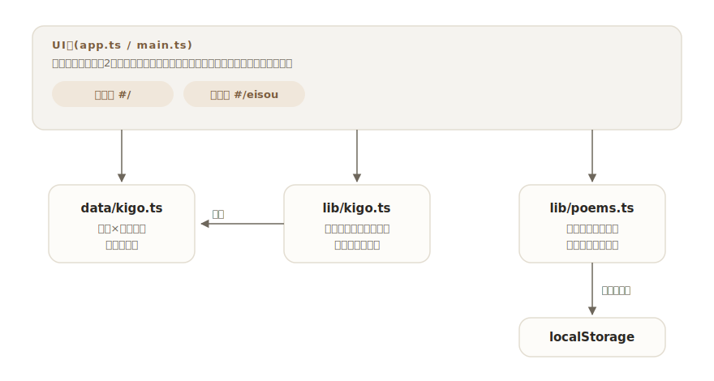

# saijiki

[](https://github.com/miruky/saijiki/actions/workflows/ci.yml)
[](https://github.com/miruky/saijiki/actions/workflows/deploy.yml)

[](LICENSE)

**俳句・短歌のための歳時記と詠草帳。季語を季節と分類でひき、詠んだ句を季語と結びつけて残すアプリ。**

公開ページ: https://miruky.github.io/saijiki/

## 概要

saijikiは句作のための小さな歳時記と、自作の句・歌を書き留める詠草帳を1つにしたものである。歳時記は春・夏・秋・冬・新年の五季と、時候・天文・地理・生活・行事・動物・植物の七分類で季語を引け、見出し語・読み・傍題のどれからでも探せる。気に入った季語の「この季語で詠む」を押すと詠草帳に季語が持ち越され、詠んだ句は季語の札とともに一覧に並ぶ。歳時記の側にも「この季語で何句詠んだか」が表示される。

詠草はブラウザのlocalStorageに保存され、サーバーには何も送らない。

### なぜ作ったのか

句作の最中は「季語を引く」と「書き留める」を何度も往復する。紙の歳時記と手帳の組み合わせは理想的だが散歩先では持ち歩かず、スマートフォンの汎用メモは季語と句が結びつかないので、あとから「あの季語で詠んだ句」を探せない。引くことと書き留めることを同じ場所に置き、季語を軸に自分の句がたまっていく形にした。

## アーキテクチャ



UI層はフレームワークなしのTypeScriptで、歳時記(`#/`)と詠草帳(`#/eisou`)をハッシュで切り替える。季語はコードから分離したデータ(`src/data/kigo.ts`)で、検索や傍題ひきはDOMに依存しない純粋なモジュールとして単体テストする。

## 技術スタック

| カテゴリ             | 技術                           |
| :------------------- | :----------------------------- |
| 言語                 | TypeScript 5(strict)           |
| ビルド               | Vite 6                         |
| テスト               | Vitest                         |
| リンタ・フォーマッタ | ESLint 9 / Prettier            |
| CI / 配信            | GitHub Actions / GitHub Pages  |
| 永続化               | localStorage(外部サービスなし) |

## 使い方

### 歳時記を引く

季節の札(春・夏・秋・冬・新年)で切り替え、分類で絞り込む。検索欄に文字を入れると、季節をまたいで見出し語・読み・傍題から探す。例えば「こがらし」で「木枯」が、「蝉時雨」で「蝉」が見つかる。各季語には読み・傍題・短い説明が付く。

### 詠草帳に書き留める

本文・形式(俳句・短歌)・季語・日付・覚え書きを書き留める。季語の欄は歳時記の見出し語から補完が効き、無季の句は空のままでよい。一覧では季語の札に季節の色が付き、詠んだ日の新しい順に並ぶ。

### 制約

- 収録している季語は約80語で、伝統的な歳時記の数千語にはまったく及ばない。よく詠まれる語を五季×七分類のバランスで選んである。
- 季語の説明は一般的な趣意の要約であり、結社・流派ごとの扱いの違いには踏み込まない。
- 詠草は端末のブラウザに保存されるため、端末をまたいだ同期はできない。

## プロジェクト構成

- `index.html` — エントリポイント
- `src/main.ts` — 起動。ストアの初期化と初回の見本データ投入
- `src/app.ts` — 歳時記・詠草帳の画面とイベント処理
- `src/icons.ts` — 線画SVGアイコン
- `src/style.css` — デザイントークンとスタイル(季節色・ライト・ダーク対応)
- `src/data/kigo.ts` — 季語データ(五季×七分類)
- `src/lib/kigo.ts` — 季語の型と検索・傍題ひき
- `src/lib/poems.ts` — 詠草の型・検証・並べ替え・永続化
- `src/lib/seed.ts` — 初回起動時の見本データ
- `docs/architecture.svg` — 構成図
- `.github/workflows/` — CI(lint・テスト・ビルド)とPagesデプロイ

## はじめ方

### 前提条件

- Node.js 22以上

### セットアップ

```bash
git clone https://github.com/miruky/saijiki.git
cd saijiki
npm install
npm run dev
```

### テストの実行

```bash
npm test
```

### Lintの実行

```bash
npm run lint
```

### ビルド

```bash
npm run build
```

GitHub Pagesではリポジトリ名のサブパスで配信されるため、デプロイ時は環境変数 `SAIJIKI_BASE=/saijiki/` でViteの `base` を切り替える(`.github/workflows/deploy.yml` 参照)。

## 設計方針

- **引くことと詠むことを隣に置く** — 歳時記から詠草帳へ季語を持ち越す導線を中心に据えた。道具の行き来をなくすことが、句作の中断を減らす。
- **季語はデータ、引き方はコード** — 季語の一覧はロジックから分離した1ファイルのデータにし、追補や差し替えがコードに波及しない。データの整合性(重複・読みの仮名・五季の網羅)はテストで守る。
- **季語を軸にした蓄積** — 詠草は季語と結びつけて保存し、歳時記側に句数を返す。使った季語が見えることで、自分の偏りや未踏の季節が分かる。
- **入力は寛容に、保存は厳密に** — 保存データの復元は型ガードで検証し、壊れた要素だけを読み飛ばす。無季も正規の状態として扱う。

## ライセンス

[MIT](LICENSE)
